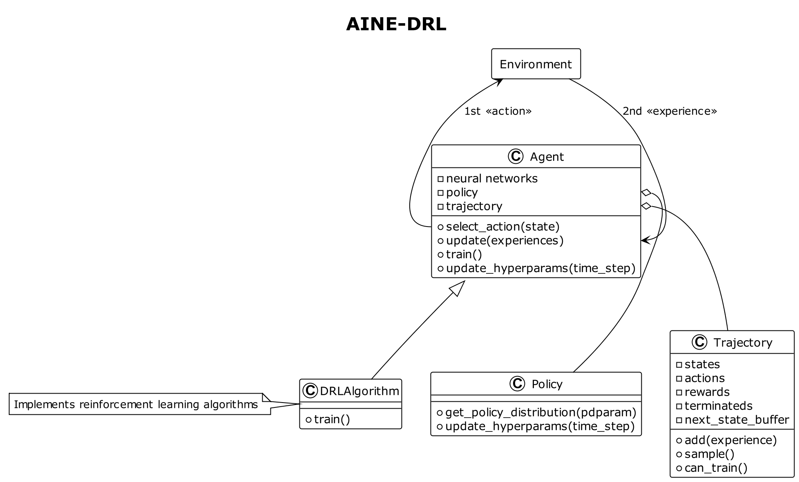

# AINE DRL

A project for the DRL framework. AINE is the team name which means "Agent IN Environment".

AINE-DRL supports below things.

* deep reinforcement learning agents
* training interrupt and agent save
* training with gym environment (vectorized environment also supported)
* rendering gym environment with inference mode

If you want to know how to use, see details in [sample codes](samples/).

## Algorithm

### Implemented

- [x] [DQN](aine_drl/agent/dqn.py)
- [x] [Double DQN](aine_drl/agent/dqn.py)
- [x] [REINFORCE](aine_drl/agent/reinforce.py)
- [x] [A2C](aine_drl/agent/a2c.py)
- [x] [PPO](aine_drl/agent/ppo/ppo.py)

### TODO

- [ ] SARSA
- [ ] Prioritized Experience Replay 
- [ ] A3C
- [ ] SAC
- [ ] Intrinsic Curiosity Module (ICM)
## Experiment

### BipedalWalker-v3 with PPO

See details of [BipedalWalker-v3](https://github.com/openai/gym/wiki/BipedalWalker-v2) environment.

Results:


* gray - no gradient clipping
* sky - gradient clipping with 0.5
* pink - gradient clipping with 5.0

Source Code: [bipedal_walker_v3_ppo.py](samples/bipedal_walker_v3_ppo.py)

## Installation

* Python 3.7.13
* Pytorch 1.11.0 - CUDA 11.3
* Tensorboard 2.10.0
* Gym 0.25.2

You can easily create an Anaconda environment. Input the command in your Anaconda shell:

```
conda env create -f aine_drl_env.yaml
```

> Note that it's recommended to match the package versions. If not, it may cause API conflicts.

## Run

Run a sample script in [samples](samples/) directory. Input the command in your shell:

```
python samples/<file_name>
```

Example:

```
python samples/cartpole_v1_a2c.py
```

Then, you can see the result in the shell and result files are generated in `results` directory. You can interrupt training by `ctrl + c`. You can also retrain at the interrupted time step. See details of `GymTraining` class in [docs](aine_drl/training/gym_training.py).

If you want to see the summarized results, input below command:

```
tensorboard --logdir=results
```

or

```
tensorboard --logdir=results/<sub_directory>
```

then, you can open a TensorBoard like below it.

 

## Module

* aine_drl
  * agent*
  * drl_util
  * policy*
  * training
  * trajectory*
  * util

> Note that `*` indicates you can directly access the module by `aine_drl`.

### Class Diagram


