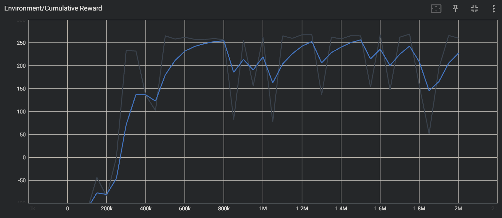
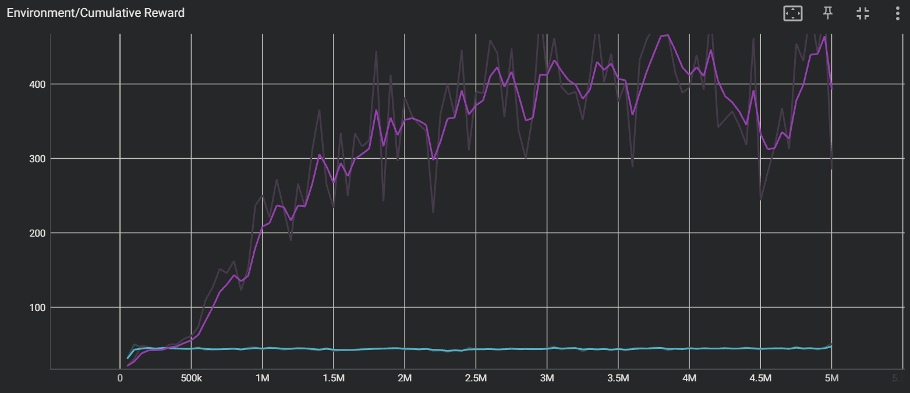
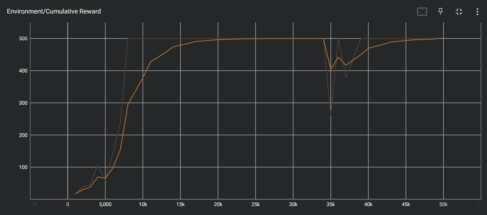

# AINE-DRL

A project for the DRL framework. **AINE** means "Agent IN Environment".

Table of Contents:

* [Implementation](#implementation)
* [Experiments](#experiments)
* [Setup](#setup)
* [Module](#module)

## Implementation

AINE-DRL provides below things.

* deep reinforcement learning agents
* training with gym environment (vectorized environment also supported) and inference (rendering)
* training interrupt and model save
* YAML configuration format

If you want to know how to use, see details in [sample codes](samples/) and [Wiki](https://github.com/DevSlem/AINE-DRL/wiki).

### Agent

AINE-DRL provides basic deep reinforcement learning (DRL) agents. If you want to use them, it's helpful to read documentations in [Wiki](https://github.com/DevSlem/AINE-DRL/wiki). 

|Agent|Source Code|
|:---:|:---:|
|[REINFORCE](https://github.com/DevSlem/AINE-DRL/wiki/REINFORCE)|[reinforce](aine_drl/agent/reinforce/)|
|[A2C](https://github.com/DevSlem/AINE-DRL/wiki/A2C)|[a2c](aine_drl/agent/a2c/)|
|[PPO](https://github.com/DevSlem/AINE-DRL/wiki/PPO)|[ppo](aine_drl/agent/ppo)|
|[Recurrent PPO](https://github.com/DevSlem/AINE-DRL/wiki/Recurrent-PPO)|[ppo](aine_drl/agent/ppo/)|
|[Double DQN](https://github.com/DevSlem/AINE-DRL/wiki/Double-DQN)|[dqn](aine_drl/agent/dqn/)|


<details>
<summary><h3>TODO</h3></summary>

- [ ] Agent Factory
- [ ] Unity ML-Agents Training
- [ ] Recurrent PPO improvement
- [ ] DDPG
- [ ] Prioritized Experience Replay 
- [ ] A3C
- [ ] SAC
- [ ] Intrinsic Curiosity Module (ICM)
- [ ] Random Network Distillation (RND)

</details>

## Experiments

You can see our experiments (source code and result) in [experiments](experiments/). We show some recent experiments.

### BipedalWalker-v3 with PPO and SAC

Train agents in OpenAI Gym [BipedalWalker-v3](https://github.com/openai/gym/wiki/BipedalWalker-v2) which is continuous action problem.

> Note that SAC is not implemented yet.

Fig 1. BipedalWalker-v3 inference rendering (PPO):


Fig 2. [BipedalWalker-v3](https://github.com/openai/gym/wiki/BipedalWalker-v2) cumulative reward (blue: PPO):



* [experiment](experiments/bipedal_walker_v3/)
* [PPO configuration](config/experiments/bipedal_walker_v3_ppo.yaml)

You can train it using the command:

```
$ python experiments/bipedal_walker_v3/train.py
```

If paging file error happens, see [Paging File Error](#paging-file-error).

You can inference it using the command:

```
$ python experiments/bipedal_walker_v3/train.py -m=inference
```

You can see graphical experiment results using the command:

```
$ tensorboard --logdir=experiments/bipedal_walker_v3
```

### CartPole-v1 with No Velocity

Compare [Recurrent PPO](https://github.com/DevSlem/AINE-DRL/wiki/Recurrent-PPO) (using LSTM) and [Naive PPO](https://github.com/DevSlem/AINE-DRL/wiki/PPO) in [CartPole-v1](https://github.com/openai/gym/wiki/CartPole-v0) with No Velocity, which is [Partially Observable Markov Decision Process (POMDP)](https://en.wikipedia.org/wiki/Partially_observable_Markov_decision_process) setting. Specifically, we remove **"cart velocity"** and **"pole velocity at tip"** from the observation space. This experiment shows to require memory ability in POMDP setting.

Fig 3. [CartPole-v1 with No Velocity](https://github.com/openai/gym/wiki/CartPole-v0) cumulative reward (purple: Recurrent PPO, sky: Naive PPO):



* [experiment](experiments/cartpole_v1_no_velocity/)
* [Recurrent PPO configuration](config/experiments/cartpole_v1_no_velocity_recurrent_ppo.yaml)
* [Naive PPO configuration](config/experiments/cartpole_v1_no_velocity_ppo.yaml)

You can train it using the command:

```
$ python experiments/cartpole_v1_no_velocity/train.py
```

You can see graphical experiment results using the command:

```
$ tensorboard --logdir=experiments/cartpole_v1_no_velocity
```

## Setup

Follow the instructions.

### Installation

* Python 3.7.13
* Pytorch 1.11.0 - CUDA 11.3
* Tensorboard 2.10.0
* Gym 0.25.2
* PyYAML 6.0

You can easily create an Anaconda environment. Input the command in your Anaconda shell:

```
$ conda env create -f conda_env.yaml
$ conda activate aine-drl
```

> Note that it's recommended to match the package versions. If not, it may cause API conflicts.

### Run

Run a sample script in [samples](samples/) directory. Input the command in your shell:

```
$ python samples/<file_name>
```

Example:

```
$ python samples/cartpole_v1_ppo.py
```

Then, you can see the training information in the shell:

```
[AINE-DRL] 'CartPole-v1_PPO' training start!
[AINE-DRL] training time: 1.0, global time step: 1002, cumulative reward: 16.6
[AINE-DRL] training time: 2.0, global time step: 2001, cumulative reward: 38.3
[AINE-DRL] training time: 3.1, global time step: 3000, cumulative reward: 45.8
```

The graphical result file (Tensorboard) is generated in `results` directory. You can interrupt training by `ctrl + c` and you can also retrain at the interrupted time step.

If you want to see the graphical result, input the command:

```
$ tensorboard --logdir=results
```

or

```
$ tensorboard --logdir=results/<sub_directory>
```

then, you can open the TensorBoard like below it.

Fig 4. [CartPole-v1](https://github.com/openai/gym/wiki/CartPole-v0) with PPO:

 

* [configuration](config/samples/cartpole_v1_ppo.yaml)
* [sample code](samples/cartpole_v1_ppo.py)

### Paging File Error

When you use too many workers (e.g., greater than 8), because of too many multi parallel environments in multi threads, **"The paging file is too small for this operation to complete."** error may happen. If it happens, you can mitigate it using the command (Windows):

```
$ pip install pefile
$ python fixNvPe.py --input=C:\<Anaconda3 Path>\envs\aine-drl\Lib\site-packages\torch\lib\*.dll
```

`<Anaconda3 Path>` is one in which your Anaconda3 is installed.

Reference: [cobryan05/fixNvPe.py (Github)](https://gist.github.com/cobryan05/7d1fe28dd370e110a372c4d268dcb2e5)  

## Module

* [aine_drl](aine_drl/)
  * [agent](aine_drl/agent/)*
  * [drl_util](aine_drl/drl_util/)
  * [policy](aine_drl/policy/)*
  * [training](aine_drl/training/)
  * [trajectory](aine_drl/trajectory/)
  * [util](aine_drl/util/)
  * [aine_config](aine_drl/aine_config.py)*
  * [experience](aine_drl/experience.py)*
  * [network](aine_drl/network.py)*

> Note that `*` indicates you can directly access API in the module using `aine_drl`.

API access example:

```python
import aine_drl

# aine_drl.aine_config.AINEConfig but you can directly access using aine_drl.AINEConfig
aine_drl.AINEConfig("config/samples/cartpole_v1_ppo.yaml")
```