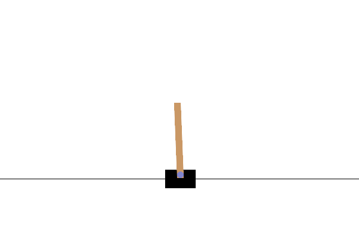

# AINE-DRL

A project for the DRL baseline framework. **AINE** means "Agent IN Environment".

[Implementation](#implementation) | [Experiments](#experiments) | [Setup](#setup) |

## Implementation

AINE-DRL provides below things.

* deep reinforcement learning agents
* train in OpenAI Gym
* inference (rendering, gif, picture)
* model save/load
* YAML configuration

If you want to know how to use, see details in [sample codes](samples/) and [Wiki](https://github.com/DevSlem/AINE-DRL/wiki).

### Agent

AINE-DRL provides deep reinforcement learning (DRL) agents. If you want to use them, it's helpful to read documentations in [Wiki](https://github.com/DevSlem/AINE-DRL/wiki). 

|Agent|Source Code|
|:---:|:---:|
|[REINFORCE](https://github.com/DevSlem/AINE-DRL/wiki/REINFORCE)|[reinforce](aine_drl/agent/reinforce/)|
|[A2C](https://github.com/DevSlem/AINE-DRL/wiki/A2C)|[a2c](aine_drl/agent/a2c/)|
|[PPO](https://github.com/DevSlem/AINE-DRL/wiki/PPO)|[ppo](aine_drl/agent/ppo)|
|[Recurrent PPO](https://github.com/DevSlem/AINE-DRL/wiki/Recurrent-PPO)|[ppo](aine_drl/agent/ppo/)|
|[Recurrent PPO RND](https://github.com/DevSlem/AINE-DRL/wiki/Recurrent-PPO-RND)|[ppo](aine_drl/agent/ppo/)|
|[Double DQN](https://github.com/DevSlem/AINE-DRL/wiki/Double-DQN)|[dqn](aine_drl/agent/dqn/)|


<details>
<summary><h3>TODO</h3></summary>

- [ ] Unity ML-Agents Training
- [ ] DDPG
- [ ] Prioritized Experience Replay 
- [ ] SAC
- [ ] Intrinsic Curiosity Module (ICM)
- [ ] Random Network Distillation (RND)

</details>

## Experiments

You can see our experiments (source code and result) in [experiments](experiments/). We show some recent experiments.

### BipedalWalker-v3 with PPO

Train agents in OpenAI Gym [BipedalWalker-v3](https://github.com/openai/gym/wiki/BipedalWalker-v2) which is continuous action space task.

Fig 1. BipedalWalker-v3 inference (PPO):


* [experiment](experiments/bipedal_walker_v3/)
* [PPO configuration](config/experiments/bipedal_walker_v3_ppo.yaml)

To train the agent, enter the following command:

```bash
python experiments/bipedal_walker_v3/run.py
```

Detail options:

```
Usage:
    experiments/bipedal_walker_v3/run.py [options]

Options:
    -i --inference                Wheter to inference [default: False].
```

If paging file error happens, see [Paging File Error](#paging-file-error).

### CartPole-v1 with No Velocity

Compare [Recurrent PPO](https://github.com/DevSlem/AINE-DRL/wiki/Recurrent-PPO) (using LSTM) and [Naive PPO](https://github.com/DevSlem/AINE-DRL/wiki/PPO) in OpenAI Gym [CartPole-v1](https://github.com/openai/gym/wiki/CartPole-v0) with No Velocity, which is [Partially Observable Markov Decision Process (POMDP)](https://en.wikipedia.org/wiki/Partially_observable_Markov_decision_process) setting. Specifically, we remove **"cart velocity"** and **"pole velocity at tip"** from the observation space. This experiment shows to require memory ability in POMDP setting.

Fig 2. [CartPole-v1 with No Velocity](https://github.com/openai/gym/wiki/CartPole-v0) inference rendering (cumulative reward - Recurrent PPO: 500, Naive PPO: 56):

|Recurrent PPO|Naive PPO|
|:---:|:---:|
|||

Fig 3. [CartPole-v1 with No Velocity](https://github.com/openai/gym/wiki/CartPole-v0) cumulative reward (black: Recurrent PPO, cyan: Naive PPO):


* [experiment](experiments/cartpole_v1_no_velocity/)
* [Recurrent PPO configuration](config/experiments/cartpole_v1_no_velocity_recurrent_ppo.yaml)
* [Naive PPO configuration](config/experiments/cartpole_v1_no_velocity_naive_ppo.yaml)

To train the Recurrent PPO agent, enter the following command:

```bash
python experiments/cartpole_v1_no_velocity/run.py
```

Detail options:

```
Usage:
    experiments/cartpole_v1_no_velocity/run.py [options]

Options:
    -a --agent=<AGENT_NAME>       Agent name (recurrent_ppo, naive_ppo) [default: recurrent_ppo].
    -i --inference                Wheter to inference [default: False].
```

## Setup

Follow the instructions.

### Installation

Required packages:

* [Python](https://www.python.org/) 3.10.8
* [Pytorch](https://pytorch.org/) 1.11.0 - CUDA 11.3
* [Tensorboard](https://github.com/tensorflow/tensorboard) 2.12.0
* [PyYAML](https://pyyaml.org/) 6.0
* [Gym](https://github.com/openai/gym) 0.26.2
* [ML-Agents](https://github.com/Unity-Technologies/ml-agents/tree/release_20) 0.30.0

> Note that it's recommended to match the package versions. If not, it may cause API conflicts.

When you use Anaconda environment, install the packages by entering the command below:

```bash
conda create -n aine-drl python=3.10.8 -y
conda activate aine-drl
conda install pytorch==1.11.0 torchvision==0.12.0 torchaudio==0.11.0 cudatoolkit=11.3 -c pytorch -y
pip install tensorboard==2.12.0
pip install PyYAML==6.0
pip install gym==0.26.2
pip install 'gym[all]'
pip install mlagents==0.30.0
pip install 'protobuf==3.20.*'
```

### Run

Run a sample script in [samples](samples/) directory. Enter the following command:

```bash
python samples/<FILE_NAME>
```

Example:

```bash
python samples/cartpole_v1_ppo.py
```

then, you can see the training information in your shell:

```
+----------------------------------------------+
| AINE-DRL Training Start!                     |
|==============================================|
| ID: CartPole-v1_PPO                          |
| Output Path: results/CartPole-v1_PPO         |
|----------------------------------------------|
| Training INFO:                               |
|     number of environments: 3                |
|     total time steps: 20000                  |
|     summary frequency: 1000                  |
|     agent save frequency: 10000              |
|----------------------------------------------|
| Agent INFO:                                  |
|     name: PPO                                |
|     device: cpu                              |
+----------------------------------------------+

[AINE-DRL] training time: 1.30, time steps: 1000, cumulated reward: 30.00
[AINE-DRL] training time: 2.57, time steps: 2000, cumulated reward: 115.00
[AINE-DRL] training time: 3.88, time steps: 3000, cumulated reward: 133.00
```

When the training is finished, you can see the results (tensorboard, log message, agent save file) in `results` directory.

Open the tensorboard result by entering the command:

```bash
tensorboard --logdir=results
```

or

```bash
tensorboard --logdir=results/<sub_directory>
```

If you want to change the inference export format like gif, png (default: real-time rendering), you need to change the `Inference` setting in the configuration file. Follow the example:

```yaml
Inference:
  Config:
    export: gif # default: render_only
```

`export` detail options: `None`, `render_only`, `gif`, `png`

### Paging File Error

When you use too many workers (e.g., greater than 8), because of too many multi parallel environments in multi threads, **"The paging file is too small for this operation to complete."** error may happen. If it happens, you can mitigate it using the command (Windows):

```bash
pip install pefile
python fixNvPe.py --input=C:\<Anaconda3 Path>\envs\aine-drl\Lib\site-packages\torch\lib\*.dll
```

`<Anaconda3 Path>` is one in which your Anaconda3 is installed.

Reference: [cobryan05/fixNvPe.py (Github)](https://gist.github.com/cobryan05/7d1fe28dd370e110a372c4d268dcb2e5)  
