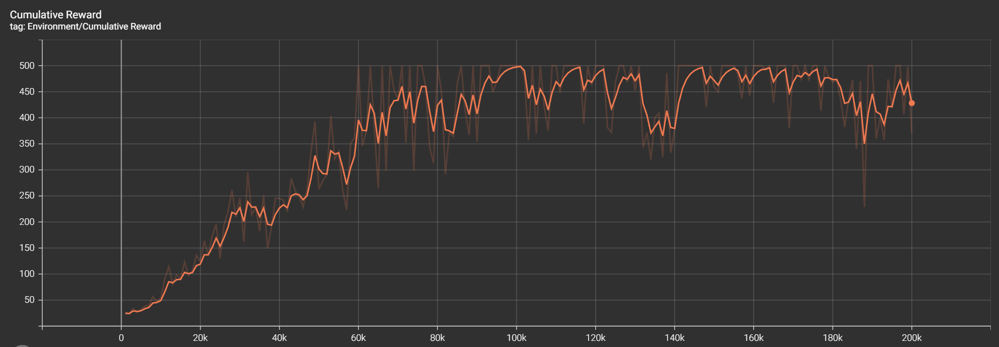

# AINE DRL

A project for the DRL framework. AINE is the team name which means "Agent IN Environment".

## Implemented Algorithm

- [x] [DQN](aine_drl/agent/dqn.py)
- [x] [Double DQN](aine_drl/agent/dqn.py)
- [x] [REINFORCE](aine_drl/agent/reinforce.py)
- [x] [A2C](aine_drl/agent/a2c.py)
- [x] [PPO](aine_drl/agent/ppo.py)

## TODO

- [ ] SARSA

## Development Environment

* Python 3.7.13
* Pytorch 1.11.0 - CUDA 11.3
* Tensorboard 2.10.0
* Gym 0.25.2

You can easily create an Anaconda environment. Input the command in your Anaconda shell:

```
conda env create -f aine_drl_env.yaml
```

> Note that it's recommended to match the package versions. If not, it may cause API conflicts.

## Run

Run a sample script in [samples](samples/) directory. Input the command in your shell:

```
python samples/<file_name>
```

Example:

```
python samples/cartpole_v1_a2c.py
```

Then, you can see the result in the shell and result files are generated in `results` directory. If you want to see the summarized results, input below command:

```
tensorboard --logdir=results
```

or

```
tensorboard --logdir=results/<sub_directory>
```

then, you can open a TensorBoard like below it.

 
