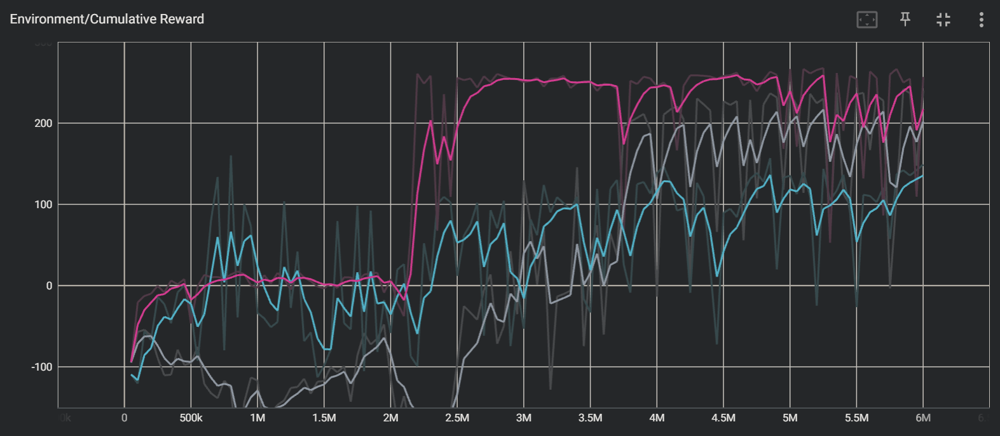

# AINE DRL

A project for the DRL framework. **AINE** is the team name which means "Agent IN Environment".

AINE-DRL supports below things.

* deep reinforcement learning agents
* training interrupt and model save
* training with gym environment (vectorized environment also supported)
* rendering gym environment with inference mode

If you want to know how to use, see details in [sample codes](samples/).

## Algorithm

### Implemented

- [x] [DQN](aine_drl/agent/dqn.py)
- [x] [Double DQN](aine_drl/agent/dqn.py)
- [x] [REINFORCE](aine_drl/agent/reinforce.py)
- [x] [A2C](aine_drl/agent/a2c.py)
- [x] [PPO](aine_drl/agent/ppo/ppo.py)

### TODO

- [ ] SARSA
- [ ] Prioritized Experience Replay 
- [ ] A3C
- [ ] SAC
- [ ] Intrinsic Curiosity Module (ICM)
## Recent Experiment

### BipedalWalker-v3 with PPO

Training experiment in OpenAI Gym [BipedalWalker-v3](https://github.com/openai/gym/wiki/BipedalWalker-v2) which is continuous action problem.

Fig 1. [BipedalWalker-v3](https://github.com/openai/gym/wiki/BipedalWalker-v2) with PPO agent:



* [configuration](config/bipedal_walker_v3_ppo.yaml)
* [sample code](samples/bipedal_walker_v3_ppo.py)

You can train it using the command:

```
$ python samples/bipedal_walker_v3_ppo.py
```

If paging file error happens, see [Paging File Error](#paging-file-error).

## Setup

Follow the instructions.

### Installation

* Python 3.7.13
* Pytorch 1.11.0 - CUDA 11.3
* Tensorboard 2.10.0
* Gym 0.25.2
* PyYAML 6.0

You can easily create an Anaconda environment. Input the command in your Anaconda shell:

```
$ conda env create -f conda_env.yaml
$ conda activate aine-drl
```

> Note that it's recommended to match the package versions. If not, it may cause API conflicts.

### Run

Run a sample script in [samples](samples/) directory. Input the command in your shell:

```
$ python samples/<file_name>
```

Example:

```
$ python samples/cartpole_v1_ppo.py
```

Then, you can see the result in the shell. The result file is also generated in `results` directory. You can interrupt training by `ctrl + c`. You can also retrain at the interrupted time step.

If you want to see the summarized results, input the command:

```
$ tensorboard --logdir=results
```

or

```
$ tensorboard --logdir=results/<sub_directory>
```

then, you can open the TensorBoard like below it.

Fig 2. [CartPole-v1](https://github.com/openai/gym/wiki/CartPole-v0) with PPO agent:

 

* [configuration](config/cartpole_v1_ppo.yaml)
* [sample code](samples/cartpole_v1_ppo.py)

### Paging File Error

When you use too many workers (e.g., greater than 8), because of too many multi parallel environments in multi threads, **"The paging file is too small for this operation to complete."** error may happen. If it happens, you can mitigate it using the command (Windows):

```
$ pip install pefile
$ python fixNvPe.py --input=C:\<Anaconda3 Path>\envs\aine-drl\Lib\site-packages\torch\lib\*.dll
```

`<Anaconda3 Path>` is one in which your Anaconda3 is installed.

Reference: [cobryan05/fixNvPe.py (Github)](https://gist.github.com/cobryan05/7d1fe28dd370e110a372c4d268dcb2e5)  

## Module

* [aine_drl](aine_drl/)
  * [agent](aine_drl/agent/)*
  * [drl_util](aine_drl/drl_util/)
  * [policy](aine_drl/policy/)*
  * [training](aine_drl/training/)
  * [trajectory](aine_drl/trajectory/)
  * [util](aine_drl/util/)
  * [experience](aine_drl/experience.py)*
  * [network](aine_drl/network.py)*

> Note that `*` indicates you can directly access API in the module by `aine_drl`.
