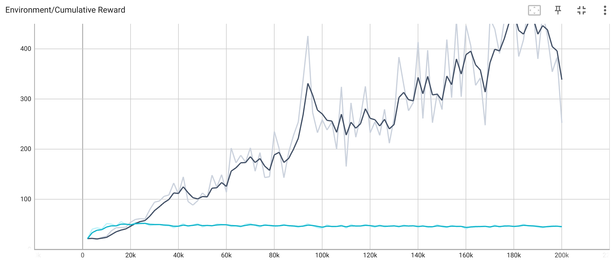

# AINE-DRL

A project for the DRL baseline framework. **AINE** means "Agent IN Environment".

[Implementation](#implementation) | [Experiments](#experiments) | [Setup](#setup) |

## Implementation

AINE-DRL provides below things:

* deep reinforcement learning agents
* compatible with [OpenAI Gym](https://github.com/openai/gym)
* compatible with [Unity ML-Agents](https://github.com/Unity-Technologies/ml-agents)
* inference (rendering, gif, picture)
* model save/load
* YAML configuration

If you want to know how to use, see [AINE-DRL Documentation](https://devslem.github.io/AINE-DRL/).

### Agent

AINE-DRL provides deep reinforcement learning (DRL) agents. If you want to use them, it's helpful to read [Agent](https://devslem.github.io/AINE-DRL/agent) docs. 

|Agent|Source Code|
|:---:|:---:|
|[REINFORCE](https://devslem.github.io/AINE-DRL/agent/reinforce)|[reinforce](aine_drl/agent/reinforce/)|
|[A2C](https://devslem.github.io/AINE-DRL/agent/a2c)|[a2c](aine_drl/agent/a2c/)|
|[Double DQN](https://devslem.github.io/AINE-DRL/agent/double-dqn)|[dqn](aine_drl/agent/dqn/)|
|[PPO](https://devslem.github.io/AINE-DRL/agent/ppo)|[ppo](aine_drl/agent/ppo)|
|[Recurrent PPO](https://devslem.github.io/AINE-DRL/recurrent-ppo)|[ppo](aine_drl/agent/ppo/)|
|[PPO RND](https://devslem.github.io/AINE-DRL/agent/ppo-rnd)|[ppo](aine_drl/agent/ppo/)|
|[Recurrent PPO RND](https://devslem.github.io/AINE-DRL/agent/recurrent-ppo-rnd)|[ppo](aine_drl/agent/ppo/)|


<details>
<summary><h3>TODO</h3></summary>

- [ ] DDPG
- [ ] Prioritized Experience Replay 
- [ ] SAC
- [ ] Intrinsic Curiosity Module (ICM)
- [ ] Random Network Distillation (RND)

</details>

## Experiments

You can see our experiments (source code and result) in [experiments](experiments/). We show some recent experiments.

### BipedalWalker-v3 with PPO

Train agents in OpenAI Gym [BipedalWalker-v3](https://github.com/openai/gym/wiki/BipedalWalker-v2) which is continuous action space task.

Fig 1. BipedalWalker-v3 inference (cumulative reward - PPO: 248):


* [experiment](experiments/bipedal_walker_v3/)
* [PPO configuration](config/experiments/bipedal_walker_v3_ppo.yaml)

To train the agent, enter the following command:

```bash
python experiments/bipedal_walker_v3/run.py
```

Detail options:

```
Usage:
    experiments/bipedal_walker_v3/run.py [options]

Options:
    -i --inference                Wheter to inference [default: False].
```

If paging file error happens, see [Paging File Error](#paging-file-error).

### CartPole-v1 with No Velocity

Compare [Recurrent PPO](https://github.com/DevSlem/AINE-DRL/wiki/Recurrent-PPO) (using LSTM) and [Naive PPO](https://github.com/DevSlem/AINE-DRL/wiki/PPO) in OpenAI Gym [CartPole-v1](https://github.com/openai/gym/wiki/CartPole-v0) with No Velocity, which is [Partially Observable Markov Decision Process (POMDP)](https://en.wikipedia.org/wiki/Partially_observable_Markov_decision_process) setting. Specifically, we remove **"cart velocity"** and **"pole velocity at tip"** from the observation space. This experiment shows to require memory ability in POMDP setting.

Fig 2. [CartPole-v1 with No Velocity](https://github.com/openai/gym/wiki/CartPole-v0) inference (cumulative reward - Recurrent PPO: 500, Naive PPO: 41):

|Recurrent PPO|Naive PPO|
|:---:|:---:|
|||

Fig 3. [CartPole-v1 with No Velocity](https://github.com/openai/gym/wiki/CartPole-v0) cumulative reward (black: Recurrent PPO, cyan: Naive PPO):



* [experiment](experiments/cartpole_v1_no_velocity/)
* [Recurrent PPO configuration](config/experiments/cartpole_v1_no_velocity_recurrent_ppo.yaml)
* [Naive PPO configuration](config/experiments/cartpole_v1_no_velocity_naive_ppo.yaml)

To train the Recurrent PPO agent, enter the following command:

```bash
python experiments/cartpole_v1_no_velocity/run.py
```

Detail options:

```
Usage:
    experiments/cartpole_v1_no_velocity/run.py [options]

Options:
    -a --agent=<AGENT_NAME>       Agent name (recurrent_ppo, naive_ppo) [default: recurrent_ppo].
    -i --inference                Wheter to inference [default: False].
```

## Setup

Follow the instructions.

### Installation

This installation guide is simple. If you have a problem or want to see details, refer to [Installation](https://devslem.github.io/AINE-DRL/installation.html) docs.

First, install [Python 3.9](https://www.python.org/) version.

Install AINE-DRL package by entering the command below:

```bash
pip install aine-drl
```

### Run

Run a sample script in [samples](samples/) directory. Enter the following command:

```bash
python samples/<FILE_NAME>
```

Example:

```bash
python samples/cartpole_v1_ppo.py
```

See details in [Getting Started](https://devslem.github.io/AINE-DRL/getting-started/) docs.

### Paging File Error

When you use too many workers (e.g., greater than 8), because of too many multi parallel environments in multi threads, **"The paging file is too small for this operation to complete."** error may happen. If it happens, you can mitigate it using the command (Windows):

```bash
pip install pefile
python fixNvPe.py --input=C:\<Anaconda3 Path>\envs\aine-drl\Lib\site-packages\torch\lib\*.dll
```

`<Anaconda3 Path>` is one in which your Anaconda3 is installed.

Reference: [cobryan05/fixNvPe.py (Github)](https://gist.github.com/cobryan05/7d1fe28dd370e110a372c4d268dcb2e5)  
